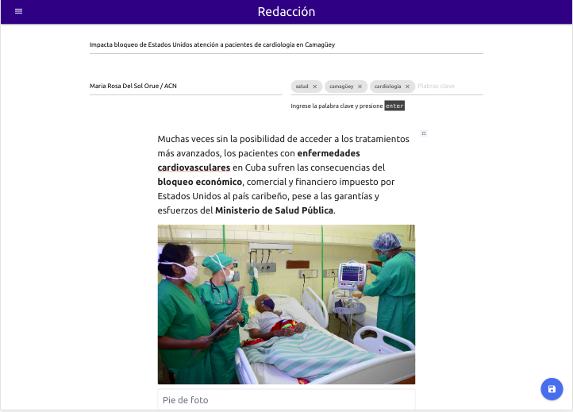

# NewsWriter

A news redaction app for adelante.cu:



## development

You need `yarn` and `node >= 12`

```bash
git clone https://github.com/ybenitezf/newswriter
cd newswriter
python3 -m venv env
. env/bin/activate
make dev
```

## tests

```bash
make test
```

Or with coverage

```bash
make coverage
```

## Install

TODO: review

```bash
pip install https://github.com/ybenitezf/newswriter/archive/master.tar.gz
```

You need to configure the instance, either by environment variables or a `.env` file:

- `SECRET_KEY`: application secret key, should be a random string
- `SQLALCHEMY_DATABASE_URI`: the database to use, see [database urls](https://docs.sqlalchemy.org/en/14/core/engines.html#database-urls) in SQLAlchemy documentation site. Defaults to SQLite and `appdb.db` in the instance folder
- `UPLOAD_FOLDER`: directory to store the users uploads, should be a full path, defaults to instalce foler + `/uploads`
- `INDEX_BASE_DIR`: directory to store indexing data for the searches
